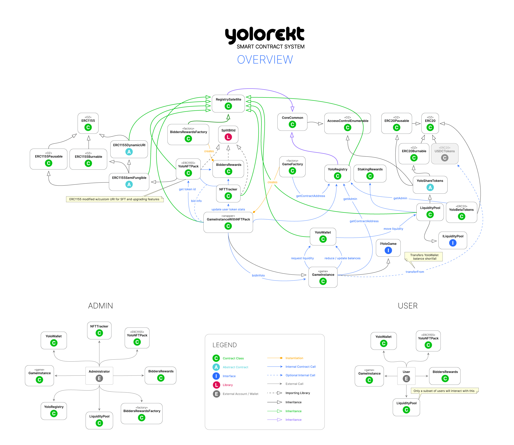
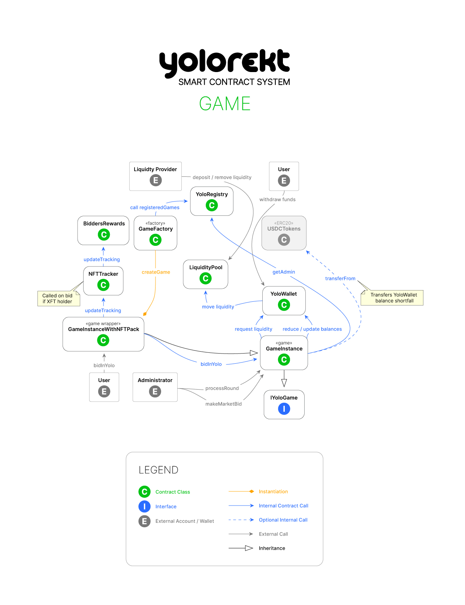
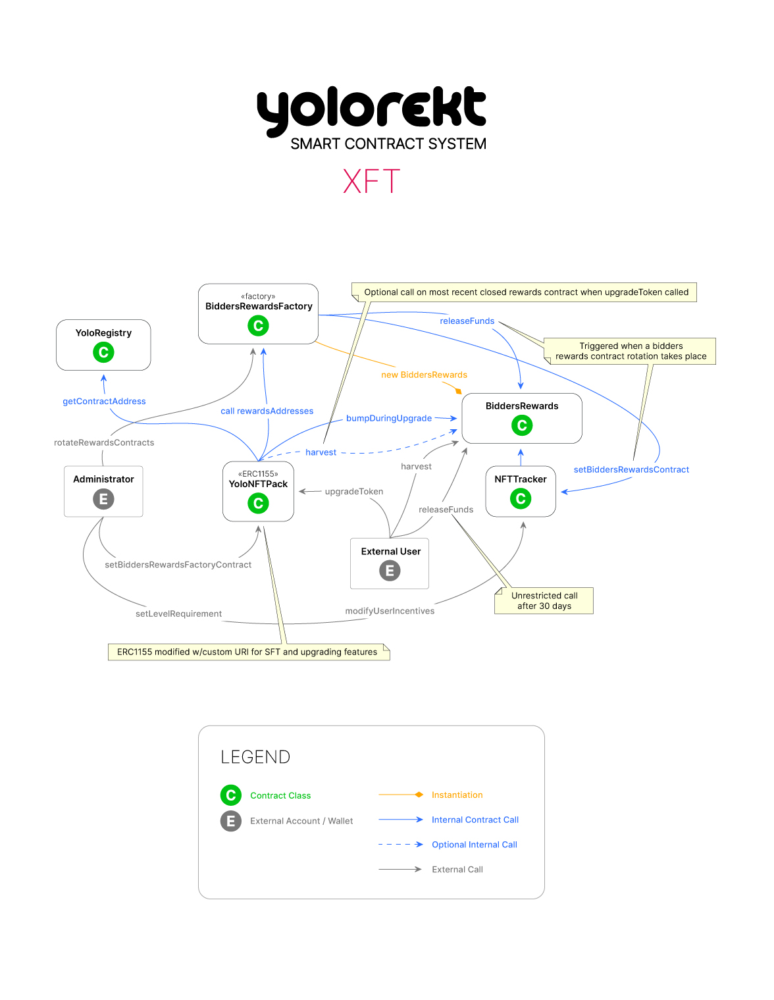
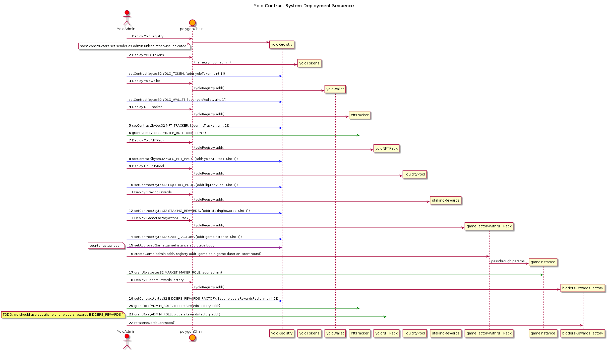

# Community Bug Bounty

The YOLO system of Smart Contracts has begun orbital descent. After months of serious effort placed into streamlining and perfecting, we are opening up our smart contracts to our community of Web3 geniuses, developers, and degens, leading to yet another Bug Bounty program.

This is a chance for EVM experts and developers to help us discover bugs and vulnerabilities and earn some serious cash at the same time.

## Bug Tiers

The program will reward discoveries based on three tiers of severity:

- **HIGH**: any vulnerability which has catastrophic implications, such as permanent Denial of Service (DOS), draining of user, liquidity provider or treasury funds, takeover of access or administrative privileges.
  _Reward: $5,000 USDC_
- **MEDIUM**: can corrupt important data, such as user participation tracking, or cause disruptions in the operation of the markets, such as delays in processing of rounds, less critical access control disruption issues.
  _Reward: $1,000-$2,000 USDC_
- **LOW**: minor, yet nontrivial oversights, causing loss or modification of noncritical data.
  _Reward: $100-$500 USDC_

There's also an **easter egg** thrown in there for fun. See if you can find the intentional bug we've planted and get _$500 USDC_. Additionally, any _significant gas efficiency improvement proposals_ with a minimum savings of 10k gas units or 20%, and which we implement, will be rewarded _$200-$2000 USDC_ (depending on frequency of code call)..

YOLO contracts are easy to use, with minimal interfaces, clear upgrade paths, and importantly, secured through repeated revision and audits. Hop in and let's get going!

## Reporting bugs

Post an Issue or PR in this repo with the following sections: impact, the vulnerability, and steps to correct. Head to our [Discord channel #bug-reporting](https://discord.com/channels/822644422017548299/988587594822586448) and give us a headsup or shout for help on reporting! You can also find the [linked task on Dework at our YOLOrekt Main Space](https://app.dework.xyz/yolorekt/main-space-86?taskId=9ea0fdb4-fff0-42b3-966e-26939339195d).

_Oh and a few more contracts will be joining this repo soon._ They'll be sure to contain some novel pattern goodies and incentivizing mechanisms. There may another easter egg as well...

To help onboard, we've provided some unit tests in this repository, as well as the class and deployment diagrams below.

